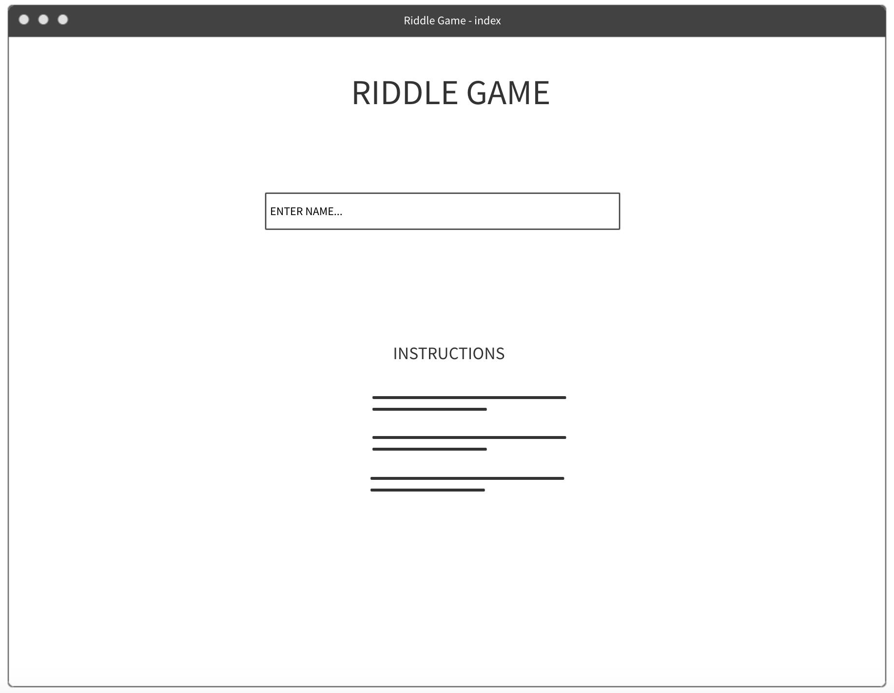
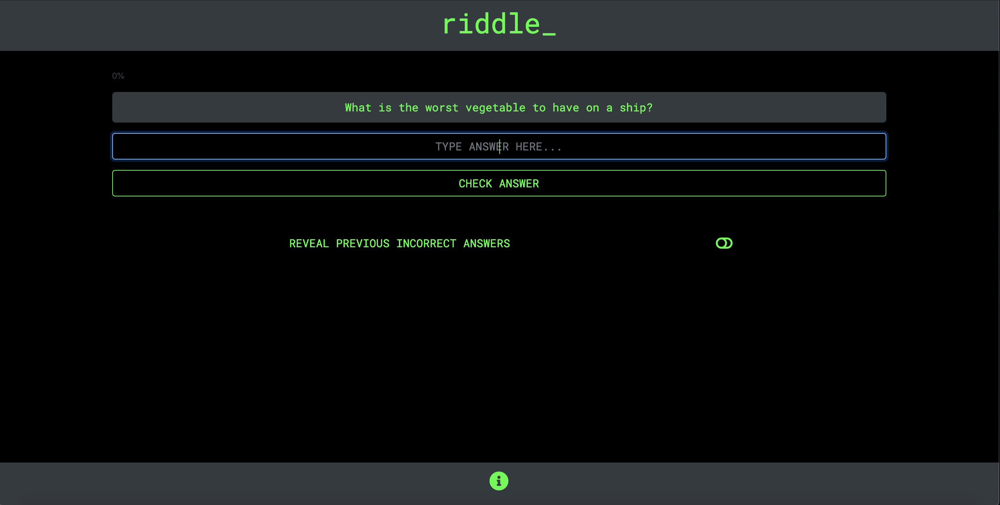

# [Riddle Game](https://python-riddle-game-ci.herokuapp.com/)

This application uses the Flask micro web framework to allow users to play a riddle game. 

The aim of the game is for the user to answer riddles displayed to them on screen. The user must first enter their name to play. Subsequently, riddles are displayed one at a time on the screen with an answer box appearing below. The user can only progress to the next riddle upon submission of a correct answer.  

Each correct answer increments their score by 1 point. If the user decides they cannot finish the game, they can quit early to view the high scores leaderboard.

 
## UX

As with other projects I have undertaken, my aim with this project was to construct an application that was simplistic in design to allow the user to easily understand and interact with it. From the early stages, I thought a retro theme would suit this project well, and colours, fonts and transitions were chosen to complement this.

### Name Entry Page

This is the page that the user first sees when loading the website. In order to proceed with the game, the user must first enter their name. As explained in later sections of this README file, this name is used to log high scores and incorrect answers.

With it's simplistic design, the user is given clear direction to the name entry field. If the user is unsure, or would like more information about how the game works, an info button which displays a list of instructions as to how the game works can be located at the bottom of the page. This button forms part of the core design for the application and can be accessed on any page of the application.

### Riddle Page

Once the user has entered their name, they are directed to the first riddle. The background colour of the riddle is a different colour to the familiar input box from the previous page, to guide the user when submitting an answer.

A percentage completion bar gradually increments as the user moves through the game to give the user an indication of their progress.

Hovering over the 'CHECK ANSWER' button on larger screens (clicking on small screens) changes the button fill colour to green feeding back to the user that the button has been clicked.

Below the riddle is a slider button and a prompt to the user that if they slide the slider, they can look at incorrect guesses submitted by other users. This slider is hidden by default to give the users more of a challenge should they desire.

The slider reveals a table of previous incorrect guesses, and the user that submitted the guess in a table that follows the retro colour scheme of the application.

### High Scores Page

If the user cannot complete the game, they can opt to quit halfway through by typing the word quit into the answer box. The user is then directed to the high-scores page where they can see their score in a table along with other users and their scores.

Again, the fonts, colours and themes on this page are closely aligned with the other pages in the application for uniformity.

### Celebration Page

If the user does complete the game, instead of also being directed to the high-scores page, they are directed to a special page with a flashing congratulations image.

## Features

The application primarily uses the Flask framework and Python logic to implement the core functionality. The Bootstrap library is also used to make all the elememnts on the page visually appealing.

### Name Submission

The user starts the game by entering their name into a `form` element. The `POST` method of this form calls on a route within the `app.py` file to access the `player_name` within the `request` object writing the user's name to a `.txt` file.

### Riddles

The riddles are stored in `JSON` format. On page load, the riddles are loaded into the context of the application such that the riddle and answer can be accessed by subsequent code. The current `riddle_number` on the page is hidden within the `form` element, and is consequently used to load the correct riddle on the page. Once the user has submitted an answer, the `riddle_number` is again used to cross reference the user's answer with the correct answer in the `JSON` file. 

If the user's answer is successful, they proceed to the next riddle.

If they are not, a flashing error message shows up on screen. 

An entry is also written into a `csv` file denoting their name, incorrect answer and riddle number. Using the information in this `csv` file, the application can identify and show previous incorrect answers for a particular riddle.

As previously mentioned, the website uses the Materialize.css library to make elements on the page visually appealing. All the Materialize components are initialised with one function call `M.AutoInit();`. As multiple css components were used in the project, this method of initialisation was preferred over individual initialisation. However, with larger projects where page performance is more of an issue, this method could be changed to individual initialisation to boost performance.

In the search bar, the `google.maps.places.Autocomplete()` API suggests cities it thinks the user is searching for. A parameter that restricts the user to just search for cities in the search bar is included in the function.

Once a city is selected and filters optionally applied, clicking the 'GO' button calls the `renderMap()` function. The `scrollToId` function uses jQuery to redirect the user to the map section of the page.

The `google.maps.Geocoder` API takes the city the user has searched for in the autocomplete search bar and identifies the latitude and longitude coordinates. The map view is then re-centered using those coordinates.

Next, any applied filters are added to the `request` object, and the `google.maps.places.PlacesService` API call is made. The `google.maps.places.nearbySearch(request, callback)` is called next. The `callback` function is taken as one of the arguments, which iterates through the results returned for that city and drops the map marker at each place location.

When the user clicks on a map marker, relevant information (obtained from the API city search results) populate each of the tabs in the place information card at the bottom of the page. Most of the details displayed are a one-to-one match i.e. only one website name, phone number etc. However, there could be multiple reviews for a returned place, so code was implemented to iterate through the reviews and display them.

### Features Left to Implement

- The website is a simple search site (which is exactly what was required from the brief), but perhaps the next step would be to implement functionality to allow the user to save/favourite locations they like.

## Technologies Used

- [JQuery](https://jquery.com)
    - The project uses **JQuery** to simplify DOM manipulation - specific examples include collapsing of the navbar when the user is not at the top of the page, and the scroll-to-section functionality
    
- [Materialize.css](https://materializecss.com/)
    - The project uses the Materialize.css for styling purposes and achieving the grid layout
    
- [Google Fonts](https://fonts.google.com/)
    - The project used Google Fonts to beautify the typography

- [Google Places API](https://developers.google.com/maps/documentation/javascript/places)
    - The project uses the Google Places API to generate place information.

- [Google Maps API](https://developers.google.com/maps/documentation/javascript/tutorial)
    - The project uses the Google Maps API to render the map on the website.

- [Google Places Autocomplete API](https://developers.google.com/maps/documentation/javascript/examples/places-autocomplete)
    - The project uses the Google Places Autocomplete API to suggest cities from the search bar.

## Testing

1. ### Search

    1. Click on the search bar and enter 'London' - cities with 'London' in the name are suggested below the search bar
    2. Click on the search bar and enter 'Berlin' - cities with 'Berlin' in the name are suggested below the search bar
    3. Click on the search bar and enter 'France' - only cities with 'France' in the name are suggested (not countries)
    4. Click the filter dropdown and select 'BARS' - collapse and reopen the filter and check selection remains selected
    5. Click 'GO' with nothing in the search bar - alert flashes on screen prompting the user to enter a city in the search bar
    6. Enter a valid city in the search bar and apply a filter - screen slides down to rendered map automatically
    
2. ### Map

    (Pre-requisite: User has entered London in the search bar, applied the 'ACCOMMODATION' filter and clicked GO)
    
    1. Map object renders correctly and centers on London.
    2. Markers drop on the map with attractions that only relate to 'ACCOMMODATION'
    3. Markers display on the map outside of the zoomed viewport (dragging the map reveals them)
    
3. ### Place Information

    (Pre-requisite: User has entered London in the search bar, applied the 'ACCOMMODATION' filter, clicked GO, and selected the map marker for 'The Royal Horseguards')

1. Clicking the map marker auto scrolls to the place information section of the page.
2. Place information card is populated with the place photo and place title ('The Royal Horseguards').
3. The address tab is populated with the address of the attraction ('2 Whitehall Ct, Westminster, London SW1A 2EJ, UK').
4. The website tab is populated with a link to the correct website URL of the attraction ('https://www.guoman.com/en/london/the-royal-horseguards.html?utm_source=google&utm_medium=organic&utm_campaign=gmb_website_click').
5. The reviews tab is populated with the most recent reviews for that attraction (verified by comparing with Google Maps search).
6. The phone tab is populated with the correct phone number for the attraction ('0800 330 8090').
    

## Deployment

The code has been deployed to GitHub, and is hosted on GitHub Pages (https://neon-flights.github.io/javascript-project/)

### Content

The information used to populate the Place Information section is obtained from the Google API

### Media
The map marker icon was obtained from FlatIcon:
    (https://www.flaticon.com/)
    
